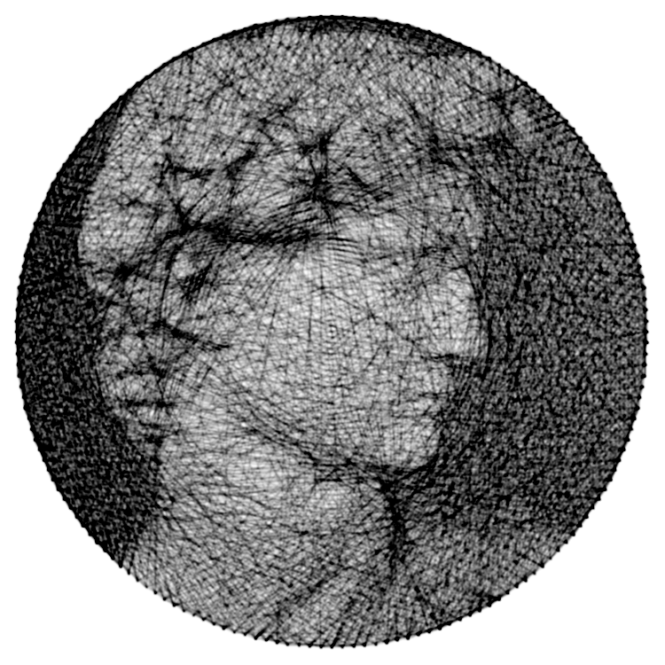
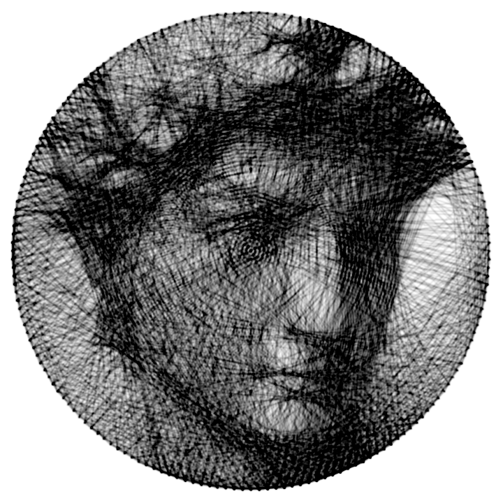
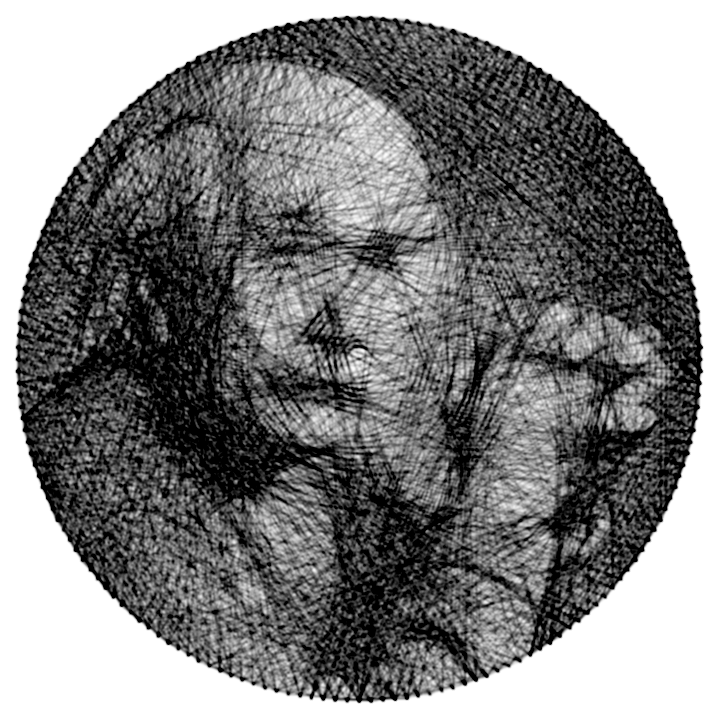
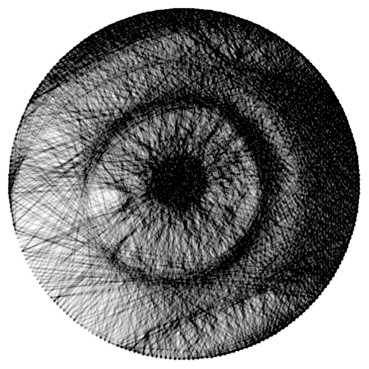
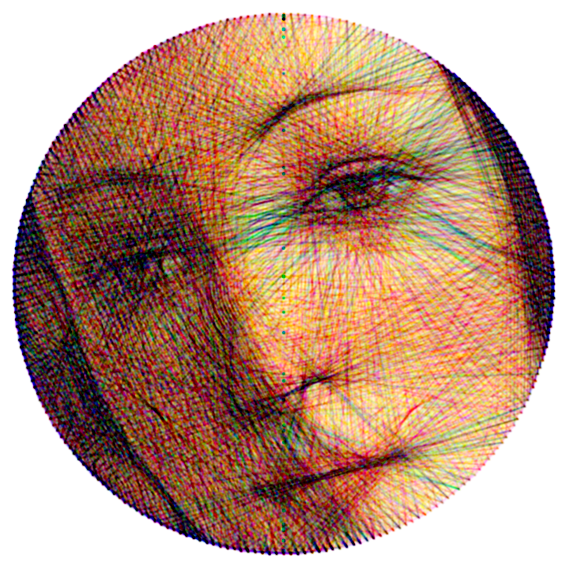
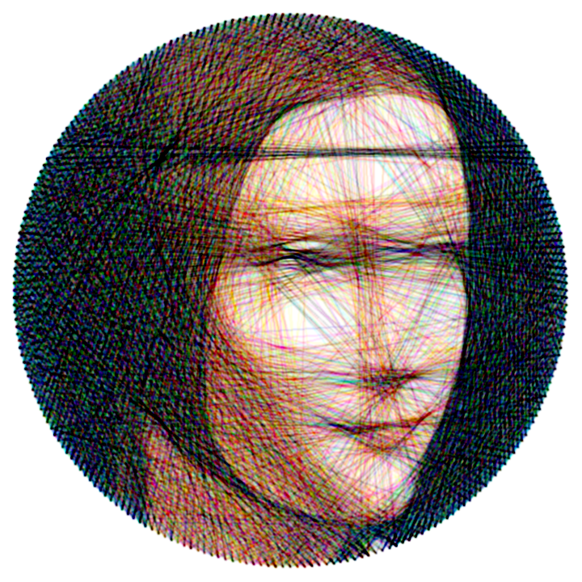
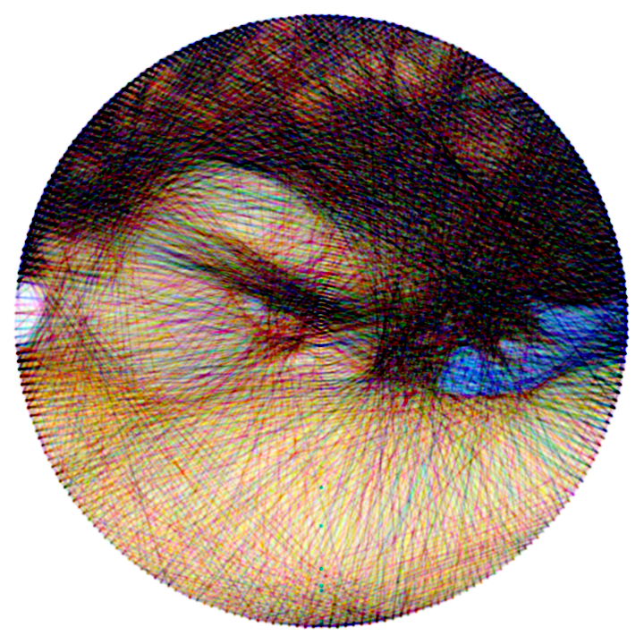

## StringArt.jl

<p align="center">
  
</p>

This script implements a simplified version of the [String Art](https://en.wikipedia.org/wiki/String_art) greedy algorithm. Given an image, it attempts to create a similar representation using a single thread wound around a circle of nails, effectively constructing an image using only lines. This technique is probably most well-know for the artistic works of [Petros Vrllis](https://www.saatchiart.com/vrellis).

Most implementations often require high-contrast images, and still the results can vary significantly from one image to another. In this version, I've tweaked the algorithm parameters to **enhance the contrast and detail in the final output**. While this adjustment impacts performance, it remains usable.

Additionally, the script features a command-line interface (CLI) with various tweakable parameters, option flags, **RGB color mode** and you can also save the **GIF animation** with easy. Feel free to explore these options to customize the output according to your preferences, if you want to reuse the code or call it somewhere else, you should look at `StringArt.run`.

**Useful Resources:**

- [The Mathematics of String Art Video](https://www.youtube.com/watch?v=WGccIFf6MF8)

### Algorithm

1. **Setup:**

- Load the source image and create an empty output image.
- Calculate pin positions and all possible lines between 2 pins.

2. **Iteration Step:**

- Choose a pin (P).
- Create all possible lines connecting P to the other pins in the circle.
- Calculate the error between each lines and the source image.
- Find the line (L) that gives the minimum error.
- Update the output image (add L) and the source image (subtract L).
- Set the pin to be the other pin of L.

**Line Generating Function:**
One-pixel-width lines (or any square/stair-like lines) do not yield good results. Experimentation with different line functions is essential here. I ended up choosing to apply the Gaussian Blur Kernel to the line. It's simple, and it works (also, it eliminates the need to fine-tune other parameters).

**Line Pixel Strength:**
Opt for low line pixel values to create nuanced shades of gray in the output image.

**Choose Pin:**
Randomizing the pin position periodically (every N steps) tends to give better results.

**Error Function:**
Arguably the most critical part of the algorithm. You should minimize the error here and not any other metric (I lost a lot of time doing that...). The best function that I found was the squared difference between the source image and the line (but the performance takes a considerable hit here).

**Excluding Already Visited Lines:**
While excluding used lines each iteration improves performance, it results in a more diffuse and noisy image. In this implementation, visited lines are retained. If you prefer the noisy style, just uncomment the lines with `filter!`.

### Requirements

The Libraries:

- ArgParse
- Images
- Logging
- Memoize

### Usage

```bash
# basic
$ julia -O3 -t 8 main.jl -i [input image] -o [output image]

# suggested
$ julia -O3 -t 8 main.jl -s 720 --steps 2000 -i [input image] -o [output image]

# alter the image resolution
$ julia -O3 -t 8 main.jl -s 800 -i [input image] -o [output image]

# RGB color mode
$ julia -O3 -t 8 main.jl --color -i [input image] -o [output image]

# Saves GIF output
$ julia -O3 -t 8 main.jl --gif -i [input image] -o [output image]
```

### Parameters

```bash
usage: main.jl -i INPUT [-o OUTPUT] [-s SIZE] [-n PINS]
               [--steps STEPS] [--gif] [--color] [--verbose] [-h]

optional arguments:
  -i, --input INPUT    input image path
  -o, --output OUTPUT  output image path whiteout extension (default:
                       "output")
  -s, --size SIZE      output image size in pixels (type: Int64,
                       default: 512)
  -n, --pins PINS      number of pins to use in canvas (type: Int64,
                       default: 180)
  --steps STEPS        number of algorithm iterations (type: Int64,
                       default: 1000)
  --gif                Save output as a GIF
  --color              RGB mode
  --verbose            verbose mode
  -h, --help           show this help message and exit
```

> keep the number of pins bellow 250 and the image size bellow 1000.

> the number of iteration steps is dependent on the image size. For size between 500 and 800, 2000 iteration is more than enough.

### Gallery

<p align="center">
  
</p>

<p align="center">
  
</p>

<p align="center">
  
</p>

#### RGB Mode

<p align="center">
  
</p>

<p align="center">
  
</p>

<p align="center">
  
</p>

#### Animation

---

### TODO

- [x] GIF mode
- [ ] take a list of files as inputs
- [x] Optimize (or cache) setup
- [ ] Eliminate graphical bug (black dots at the center)
- [ ] make it more memory efficient (sparse matrix doesn't work)
- [ ] port the code to the GPU
