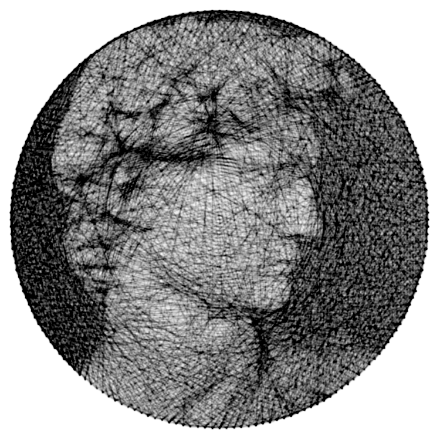
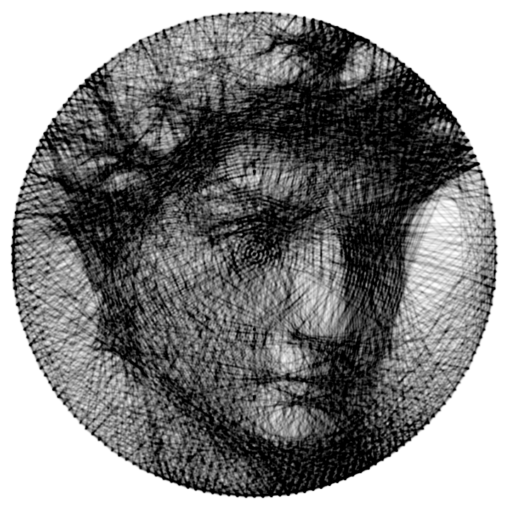
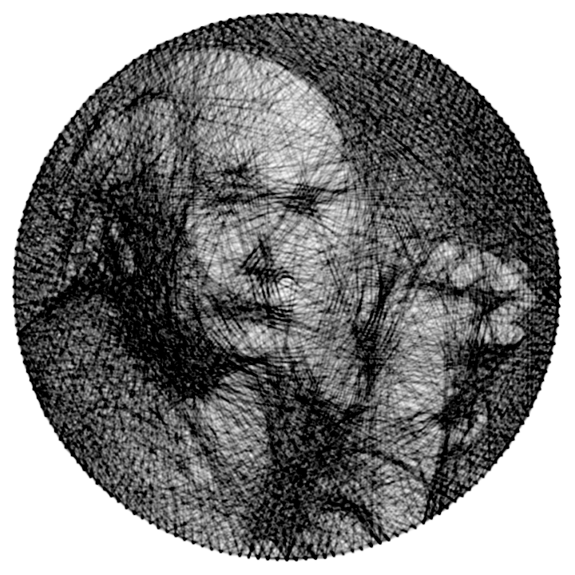
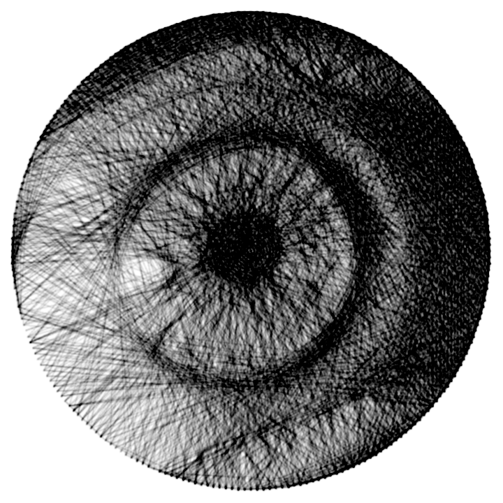
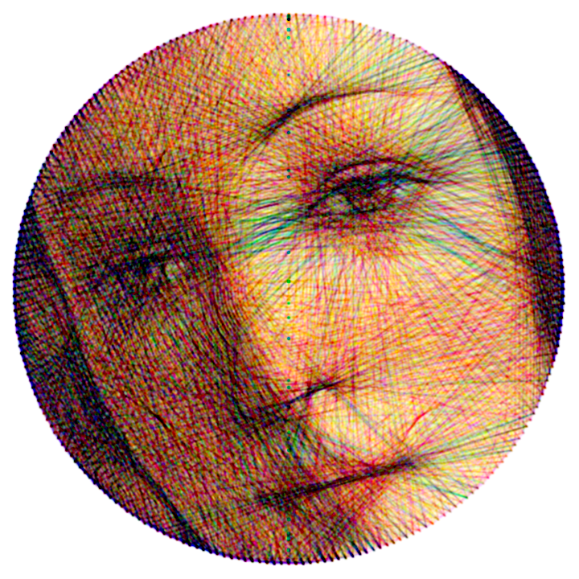
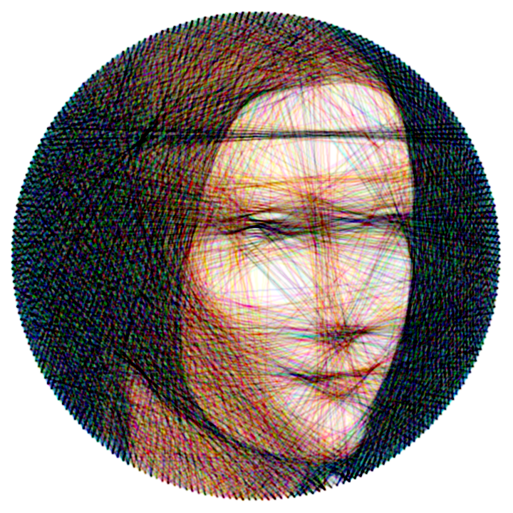
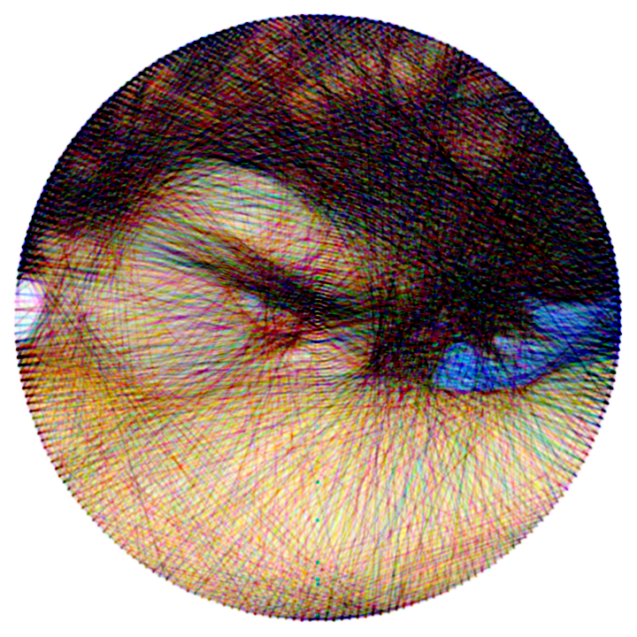
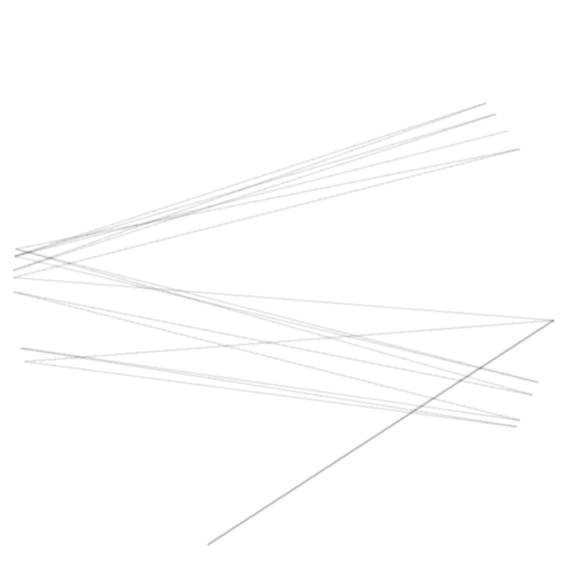

## StringArt.jl

<p align="center">
  
</p>

This script implements a simplified version of the [String Art](https://en.wikipedia.org/wiki/String_art) greedy algorithm. Given an image, it attempts to create a similar representation using a single thread wound around a circle of nails, effectively constructing an image using only lines. This technique is probably most well-know for the artistic works of [Petros Vrllis](https://www.saatchiart.com/vrellis).

Most implementations often require high-contrast images, and still the results can vary significantly from one image to another. In this version, I've tweaked the algorithm parameters to **enhance the contrast and detail in the final output**. While this adjustment impacts performance, it remains usable.

Additionally, the script features a command-line interface (CLI) with various tweakable parameters, option flags, **RGB color mode** and you can also save the **GIF animation** with easy. Feel free to explore these options to customize the output according to your preferences, if you want to reuse the code or call it somewhere else, you should look at `StringArt.render`.

**Useful Resources:**

- [The Mathematics of String Art Video](https://www.youtube.com/watch?v=WGccIFf6MF8)

### Algorithm

1. **Setup:**

- Load the source image and create an empty output image.
- Calculate pin positions and all possible lines between 2 pins.

2. **Iteration Step:**

- Choose a pin (P).
- Score all neighbor chords from P against the residual (parallel).
- Pick the chord (L) with the minimum score.
- Subtract L's weights from the residual in place.
- Hop to the other endpoint of L — unless an EMA-gain stall triggers a jump to the highest-residual pin instead.

**Line Generating Function:**
Each chord is rasterized once (Bresenham + 5-tap gaussian dilation perpendicular to the major axis, kernel `(0.06, 0.24, 0.40, 0.24, 0.06)`) into a sparse `(idx, w)` pair — column-major pixel indices and per-pixel weights — precomputed at `build_pinset` time. Wu antialiasing was tried and reverted (output visibly worse without strength compensation).

**Line Pixel Strength:**
`--line-strength` (0–100) is the base intensity, rescaled per color layer by `adaptive_strength`: bright targets (small mean residual) get boosted strength so each chord counts; dark targets get lowered strength for finer control. Clamped to `[0.5×, 2×]`.

**Choose Pin:**
An EMA of per-step gain (`α = 0.05`) is tracked. When the EMA drops below `0.30 × initial_gain` (and at least 20 steps since the last jump), the next pin becomes the one whose ±20 px residual sum is highest, redirecting effort where ink is still needed. Otherwise the walk hops to the chord's other endpoint.

**Error Function:**
The greedy pick scores candidates against a persistent `residual::Vector{Float32}` (initial `complement(target)` flattened). Score is `-Σ w[k] · r[k] · |r[k]|` over the pixels the chord touches — magnitude-squared with sign preserved, so dark pixels dominate ranking while oversaturated (negative-residual) pixels contribute a positive term that repels further chords. Once the best score is ≥ 0 (after a 50-step warmup) the loop early-stops as converged.

**Color Modes:**
- **Grayscale**: histogram-equalized single layer.
- **RGB**: shared luminance gain (`min(y_eq / y, 4)`) applied to R/G/B so hue is preserved (per-channel eq shifts skin tones).
- **Palette**: k-means centroids in Lab; each layer is a gaussian selectivity map in Lab distance with σ auto-tuned to `0.5 × median pairwise ΔE`.

Each color layer runs the full `--steps` budget (not divided across colors) and its picked chords are shuffled before rendering so no single color dominates the top of the stack.

**Excluding Already Visited Lines:**
While excluding used lines each iteration improves performance, it results in a more diffuse and noisy image. Off by default. Pass `--exclude-repeated-pins` to enable.

### Requirements

The Libraries:

- ArgParse
- Clustering
- Colors
- FileIO
- **Images**
- Dates, Logging, Printf, Random, SHA, Statistics, TOML, Test (stdlib)

### Usage

Output format is inferred from the `-o` file extension (`.png`, `.svg`, `.gif`). Comma-separate multiple paths to emit several formats in one run.

```bash
# basic
$ julia -O3 -t 8 main.jl -i input.jpg -o output.png

# suggested
$ julia -O3 -t 8 main.jl -s 720 --steps 2000 -i input.jpg -o output.png

# alter the image resolution
$ julia -O3 -t 8 main.jl -s 800 -i input.jpg -o output.png

# RGB color mode
$ julia -O3 -t 8 main.jl --rgb -i input.jpg -o output.png

# RGB color mode with custom colors
$ julia -O3 -t 8 main.jl --custom-colors "#FFFF33,#33FFFF" -i input.jpg -o output.png

# RGB color using color palette (n = 4) extracted from the input image
$ julia -O3 -t 8 main.jl --palette 4 -i input.jpg -o output.png

# GIF output (extension picks the format)
$ julia -O3 -t 8 main.jl -i input.jpg -o output.gif

# SVG output
$ julia -O3 -t 8 main.jl -i input.jpg -o output.svg

# PNG + SVG + GIF in a single run
$ julia -O3 -t 8 main.jl -i input.jpg -o output.png,output.svg,output.gif
```

### Debugging Utilities

```bash
# plot pins used in the image
$ julia utils.jl -f plot_pins -i input.jpg -o pins.png

# plot all chords radiating from the first pin
$ julia utils.jl -f plot_chords -i input.jpg -o chords.png
```

### Parameters

```bash
usage: main.jl -i INPUT [-o OUTPUT] [-s SIZE] [--steps STEPS] [-v]
               [-n PINS] [--line-strength LINE-STRENGTH] [--rgb]
               [--custom-colors CUSTOM-COLORS] [--palette PALETTE]
               [--exclude-repeated-pins] [-h]

StringArt - Convert images to string art

optional arguments:
  -i, --input INPUT     input image path
  -o, --output OUTPUT   output path with extension (.png/.svg/.gif);
                        comma-separate for multiple (default:
                        "output.png")
  -s, --size SIZE       output canvas size in pixels (type: Int64,
                        default: 512)
  --steps STEPS         algorithm iteration count (type: Int64,
                        default: 1000)
  -v, --verbose         verbose (debug) logging
  -n, --pins PINS       number of pins to use in canvas (type: Int64,
                        default: 180)
  --line-strength LINE-STRENGTH
                        line intensity ranging from 1-100 (type:
                        Int64, default: 25)
  --rgb                 use basic RGB color mode (default: red, green,
                        blue)
  --custom-colors CUSTOM-COLORS
                        comma-separated HEX color codes for custom
                        color strands (e.g. #FF0000,#00FF00)
  --palette PALETTE     number of colors to extract as a palette from
                        the input image (k-means clustering) (type:
                        Int64)
  --exclude-repeated-pins
                        skip chords already drawn (yields noisier /
                        more diffuse output)
  -h, --help            show this help message and exit

Example: julia main.jl -i input.jpg -o output.png
```

> keep the number of pins below 250 and the image size below 1000.

> the number of iteration steps is dependent on the image size. For size between 500 and 800, 2000 iteration is more than enough.

### Gallery

<p align="center">
  
</p>

<p align="center">
  
</p>

<p align="center">
  
</p>

#### RGB Mode

<p align="center">
  
</p>

<p align="center">
  
</p>

<p align="center">
  
</p>

#### Animation

<p align="center">
  
</p>

---

### TODO

- [x] Write output image as GIF
- [x] Write output image as SVG
- [x] Optimize memory usage
- [x] Support GIF in `--rgb` mode
- [x] Use user provided colors (`--custom-colors` flag) to create the output image
- [x] Use color palette (`--palette` flag) from input image to create the output image
- [x] Enhance Image Contrast (histogram-eq, luminance-gain RGB, adaptive strength)
- [ ] Port Code to the GPU
